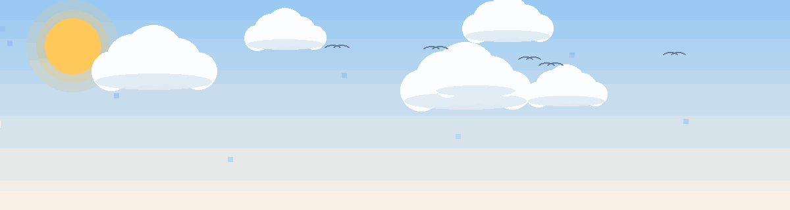

<picture>
  <source media="(prefers-color-scheme: dark)" srcset="4276cf47-fb12-47f4-9e97-303549a5dc79.gif">
  
</picture>

  <picture>
    <source media="(prefers-color-scheme: dark)" srcset="https://readme-typing-svg.herokuapp.com?font=Fira+Code&weight=600&size=26&pause=1000&color=00D4FF&center=true&vCenter=true&width=700&lines=Hi%2C+I%27m+Deepti+Nanda+%F0%9F%91%8B;Aspiring+Full-Stack+Developer;I+build+tech+that+solves+real+problems">
    
  </picture>

<em>BCA @ Sarala Birla University · Ranchi, India</em>

  
  
  
  
  
  

### 🚀 Featured Projects

| Project | One-liner | Stack |
|---|---|---|
| [**Raksha**](https://github.com/Deepti-Nanda/raksha) | Offline AI health guardian — risk scoring & SOS for heat waves, floods & smog | React Native · TypeScript |
| [**Sanjeevni**](https://github.com/Deepti-Nanda/Sanjeevni) | Real-time hospital emergency management — beds, ICU & contacts in seconds | Node.js · Express · MongoDB |
| [**KrishiSahay**](https://github.com/Deepti-Nanda/KrishiSahay) | Bridging traditional farming with modern tech | Django · PostgreSQL |
| [**A Pinch of Memories**](https://github.com/Deepti-Nanda/APinchOfMemories) | Recipe site celebrating Indian home cooking | HTML · CSS · JS |

### 🏆 Highlights

- 🛰️ IIRS-ISRO certified in Remote Sensing — Grade A+
- ⚡ Hackathon builder — I learn by shipping
- 🧠 DSA practice on [LeetCode](https://leetcode.com/u/Deepti_Nanda/)

### 📊 Statistics

  <picture>
    <source media="(prefers-color-scheme: dark)" srcset="https://github-readme-stats.vercel.app/api?username=Deepti-Nanda&show_icons=true&theme=tokyonight&hide_border=true">
    
  </picture>
  <picture>
    <source media="(prefers-color-scheme: dark)" srcset="https://github-readme-stats.vercel.app/api/top-langs/?username=Deepti-Nanda&layout=compact&theme=tokyonight&hide_border=true">
    
  </picture>
  <picture>
    <source media="(prefers-color-scheme: dark)" srcset="https://github-readme-streak-stats.herokuapp.com/?user=Deepti-Nanda&theme=tokyonight&hide_border=true">
    
  </picture>

### 📫 Let's connect

  
  
  

